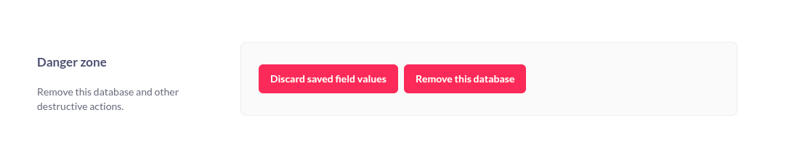
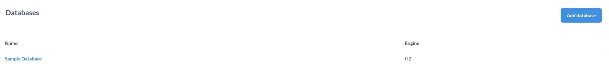
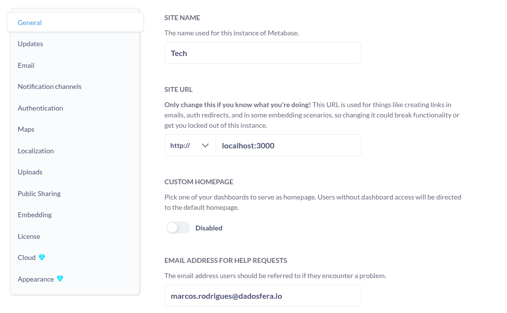
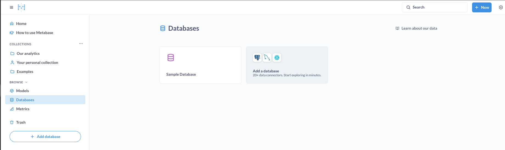
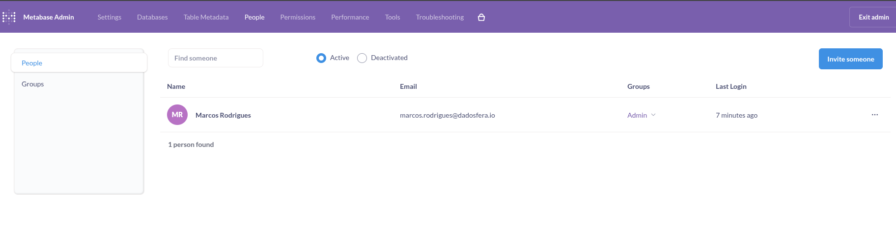
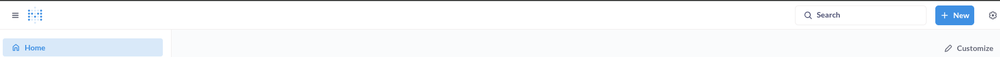
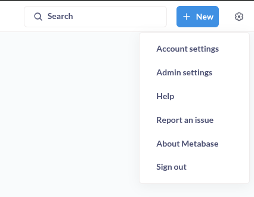

# Mudança do Metabase

versão atual: v0.55.20

Descrição: São as alterações do metabase oficial que foram sobrescritas pela dadosfera, para ser oferta como módulo de visualização, a maioria das alterações inclui:
1. Comentar componente da ui para esconder funcionalidades como por exemplo: deletar databases e gerenciamento de usuarios
2. Adaptação da ui para incluir a logo dadosfera, como por exemplo em footer e headers
3. Adição da lib mixpanel para coletar eventos da ui, como por exemplo click de download, login, criação de question entre outros

## 1 Database Danger Zone

Componente para remover databases do painel de admin foi comentado
path do arquivo: frontend/src/metabase/admin/databases/containers/DatabaseEditApp.tsx
path da página: /admin/databases/:id

### Antes da Alteração

## 2 Oculta database de exemplo e da engine h2

Foi criado um filtro do array de databases original para desconsiderar h2 e bancos com o 'Sample' no nome
path do arquivo: frontend/src/metabase/admin/databases/conponentes/DatabaseList/DatabaseList.jsx
path da página: /admin/databases

### Antes da Alteração

## 3 Oculta database de exemplo, engine h2 e remover opção de adicionar banco de dados

Foi criado um filtro do array de databases original para desconsiderar h2 e bancos com o 'Sample' no nome, e foi comentado o botão que abre a modal para inserir um novo database
path do arquivo: frontend/src/metabase/admin/databases/components/DatabaseList/DatabaseList.jsx
path da página: /admin/databases

### Antes da Alteração

## 4 Oculta tabs de setting no painel de admin

Foi criado um filtro da opções de setting do painel de admin para ocultar as seguintes tabs:
- setup
- general
- updates
- authentication
- public-sharing
- emdedding-in-other-applications
- license
- cloud
- whitelabel (Appearance)

path do arquivo: frontend/src/metabase/admin/setting/app/components/SettingsEditor/SettingsEditor.jsx
path da página: /admin/settings/general

### Antes da Alteração

## 5 Oculta opção de adicionar banco no browser

Na sessão browser na sidebar da direta foi criado um filtro para remover os bancos com 'Sample' no nome e da engine H2, e foi comentado o card que leva para a criação de novos databases 

path do arquivo: frontend/src/metabase/browse/databases/BrowseDatabases.tsx
path da página: /browse/databases

### Antes da Alteração

## 6 Oculta opção de adicionar banco no browser

Na sessão browser na sidebar da direta foi criado um filtro para remover os bancos com 'Sample' no nome e da engine H2, e foi comentado o card que leva para a criação de novos databases 

path do arquivo: frontend/src/metabase/browse/databases/BrowseDatabases.tsx
path da página: /browse/databases

### Antes da Alteração

## 7 Alteração no submit do form de databases

Motivo da alteração desconhecido foi preservado das alterações da branch da dadosfera, foi comentado a chamada do submit de um form sobre databases e foi criado um filtro na lista de engine onde o type é diferente de 'section'

path do arquivo: frontend/src/metabase/browse/databases/components/DatabaseForm/DatabaseForm.tsx
path da página: ?

### Antes da Alteração

?

## 8 Redirecionar o link People para Dadosfera

Foi criado um condicional para mandar todos os admins que clica em people na navbar da página de admin, para o gerenciamento de usuários da dadosfera

path do arquivo:
- frontend/src/metabase/nav/components/AdminNavBar/AdminNavItem.tsx
- frontend/src/metabase/nav/components/AdminNavBar/AdminNavItem.styled.tsx

path da página: /admin/people

### Antes da Alteração

## 9 Remover links de Permissions, Tools, e Troubleshooting na navbar da página de admin

Foi filtrado da lista de links da navbar, as opções:
- troubleshooting
- permissions
- tools

path do arquivo:
- frontend/src/metabase/nav/components/AdminNavBar/AdminNavbar.tsx
- frontend/src/metabase/nav/components/AdminNavBar/AdminNavbar.styled.tsx

path da página:
- /admin/troubleshooting/help
- /admin/tools/errors
- /admin/permissions/data/group

### Antes da Alteração

## 10 Logo dadosfera no navbar principal

Foi adicionado a logo da dadosfera ao lado do icone do metabase

path do arquivo:
- frontend/src/metabase/nav/components/AppBar/AppBarLogo.tsx
- frontend/src/metabase/nav/components/AppBar/AppBarLogo.styled.tsx
- resources/frontend_client/app/img/ddf-d.svg

path da página:
- todas exceto admin

### Antes da Alteração

## 11 Remove opções do menu da sidebar

Foi comentado as seguintes opções do menu da sidebar:
- Help
- How to use metabase
- Report issue
- about

path do arquivo:
- frontend/src/metabase/nav/components/ProfileLink.jsx

path da página:
- todas exceto admin

### Antes da Alteração

## 12 Adicionar logo Dadosfera no footer do embedding

Foi adicionado a logo Dadosfera no footer do embedding

path do arquivo:
- frontend/src/metabase/public/components/EmbedFrame/EmbedFrame.tsx

path da página:
- /public/dashboard

### Antes da Alteração

## 13 Filtro para removar "Sample Database" e engine H2

Foi criado um filtro para remover os databases com nome "Sample Database" e das engine H2

path do arquivo:
- frontend/src/metabase/reference/databases/DatabaseList.jsx

path da página:
- ?

### Antes da Alteração

- ?

## 14 Eventos do mixpanel

Foi adicionado o sdk do mixpanel para coletar gerar eventos no metabase

- "metabase_login"
- "metabase_summarize_open"
- "metabase_summarize_close"
- "metabase_summarize_done"
- "metabase_summarize_run_query"
- "metabase_question_native_open"
- "metabase_model_open"
- "metabase_create_dashboard"
- "metabase_create_collection"
- "metabase_access_people"
- "metabase_xray"
- "metabase_card_save"
- "metabase_dashboard_save"
- "metabase-user"

path do arquivo:
- package.json
- yarn.lock
- frontend/src/metabase/plugins/mixpanel
- "metabase_xray"
    - frontend/src/metabase/reference/databases/TableSidebar.jsx
    - frontend/src/metabase/browse/tables/TableBrowser/TableBrowser.jsx
- "metabase_create_dashboard"
    - frontend/src/metabase/dashboard/containers/CreateDashboardModal.tsx
- "metabase_create_collection"
    - frontend/src/metabase/collections/containers/CreateCollectionModal.tsx
- "metabase_login"
    - frontend/src/metabase/auth/action.ts
- "metabase_summarize_open"
- "metabase_summarize_close"
    - frontend/src/metabase/query_builder/components/view/ViewHeader/components/QuestionSummarizeWidget.jsx
- "metabase_summarize_done"
    - frontend/src/metabase/query_builder/components/view/View/StructuredQueryRightSidebar/StructuredQueryRightSidebar.jsx
- "metabase_card_save"
    - frontend/src/metabase/components/SaveQuestionForm.tsx
- "metabase_model_open"
- "metabase_question_native_open"
    - frontend/src/metabase/query_builder/containers/QueryBuilder.tsx

# 15 Envio de email

Foi colocado um if false no provavel fluxo de envio de email

path do arquivo:
- src/metabase/channel/email.clj

# 16 Remover CTA de migração para Metabase cloud

Foi removido os cta da pagina de settings sobre migração para o metabase cloud

path do arquivo:
- frontend/src/metabase/admin/perfornance/components/StrategyEditorForDatabases.tsx
- frontend/src/metabase/admin/settings/app/components/Email/SMTPConnectionForm.tsx
- frontend/src/metabase/admin/settings/components/UploadSettings.tsx

# 17 Remover botão de add banco de dados e link de how to use

Foi removido um botão que foi adicionado na sidebar que levava para a página de adicionar novos bancos, que alteriormente já tinhamos ocultado, junto com um novo link que levava para uma descrição de como usar o metabase, porém tinha links diretos também para páginas administrativas que tinhamos ocultado

path do arquivo:
- frontend/src/metabase/nav/containers/MainNavbar/MainNavbarContainer/MainNavbarView.tsx

# 18 Ocultar alteração de email, nome e senha na página de conta

Foi ocultado os campos de email, primeiro nome e sobrenome do formulário de perfil do usuário, e removido a tab e rota de alteração de senha. Usuários não devem alterar esses dados pela interface do metabase, pois são gerenciados pela Dadosfera.

path do arquivo:
- frontend/src/metabase/account/app/components/AccountHeader/AccountHeader.tsx
- frontend/src/metabase/account/profile/components/UserProfileForm/UserProfileForm.tsx
- frontend/src/metabase/account/routes.jsx